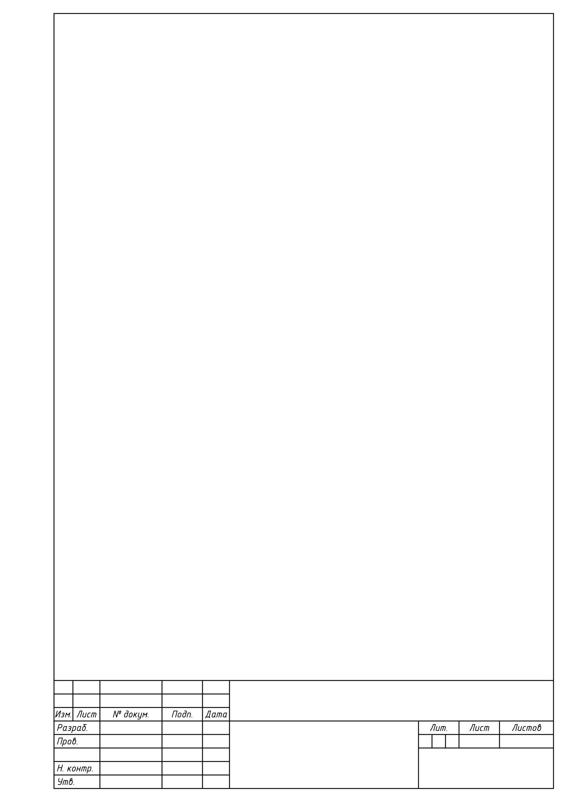

## ГОСТ 2.104-2006 в Figma

Алгоритм добавления проекта в Figma:
1. Откройте [Figma](https://www.figma.com).
1. Нажмите `Drafts`.
1. Нажмите `Import`.
1. Выберите файл [GOST_2.104-2006_FIGMA_A4.fig](GOST_2.104-2006_FIGMA_A4.fig).

Разработаная рамка А4 приведена на рисунке 1.

Рисунок 1 - Пример рамки A4 в Figma

Для того, чтобы работал шрифт GOSTRUS установите Figma (не используйте браузер) и шрифты:
- [GTRS_RtpA.ttf](fonts/GOSTRUS/GTRS_RtpA.ttf);
- [GTRS_RtpB.ttf](fonts/GOSTRUS/GTRS_RtpB.ttf);
- [GTRS_StpB.ttf](fonts/GOSTRUS/GTRS_StpB.ttf).
